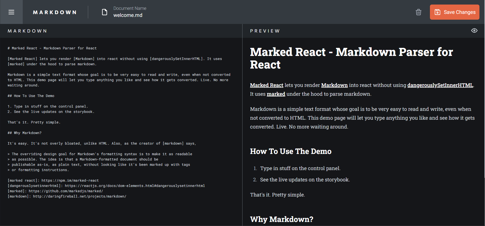
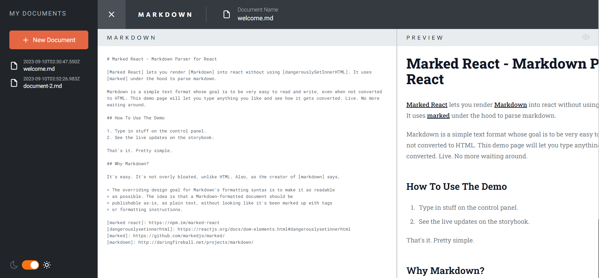
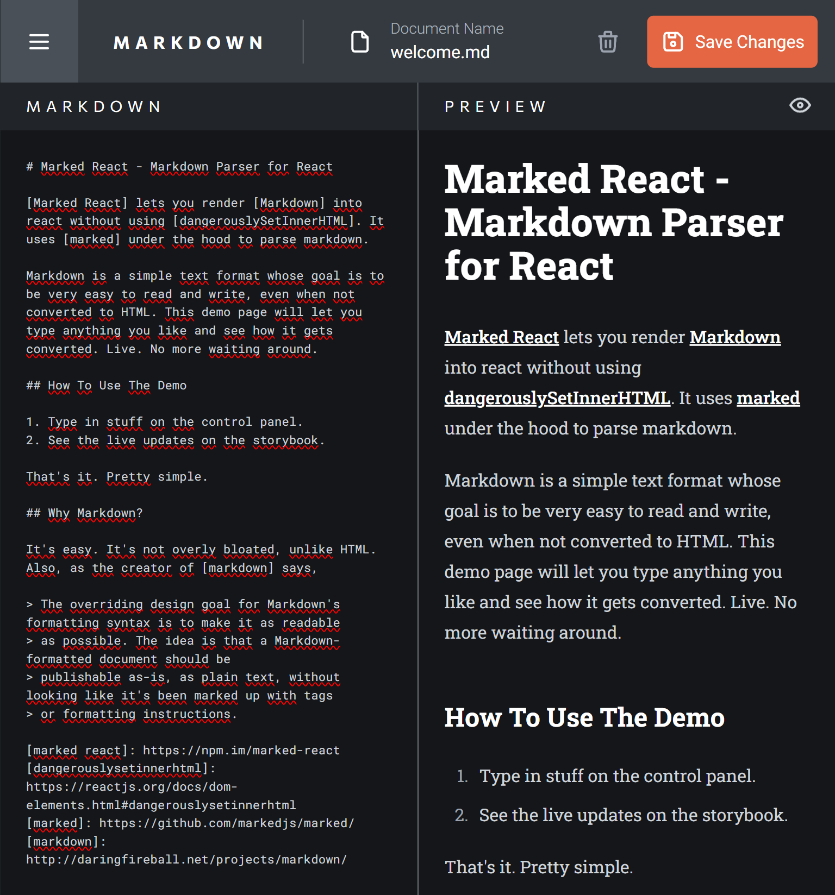
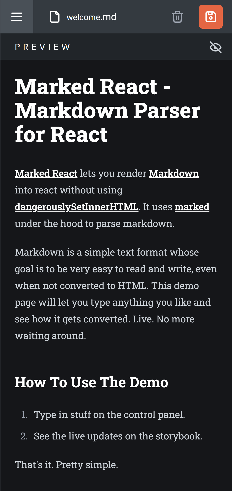

# Markdown Editor

## Description

This is project from [Frontend Mentor](https://www.frontendmentor.io/challenges/inbrowser-markdown-editor-r16TrrQX9) where I had to build out a Markdown previewer and get it looking as close to the design as possible.

## Overview

### The challenge

Users should be able to:

- View the optimal layout for the site depending on their device's screen size
- Write markdown text in the left-hand textarea
- See the preview of the markdown text in the right-hand section
- Save the markdown text to local storage and have it persist on reload
- Delete the current markdown text from local storage when the delete button is clicked
- Toggle the current theme between light and dark mode

### Screenshots

